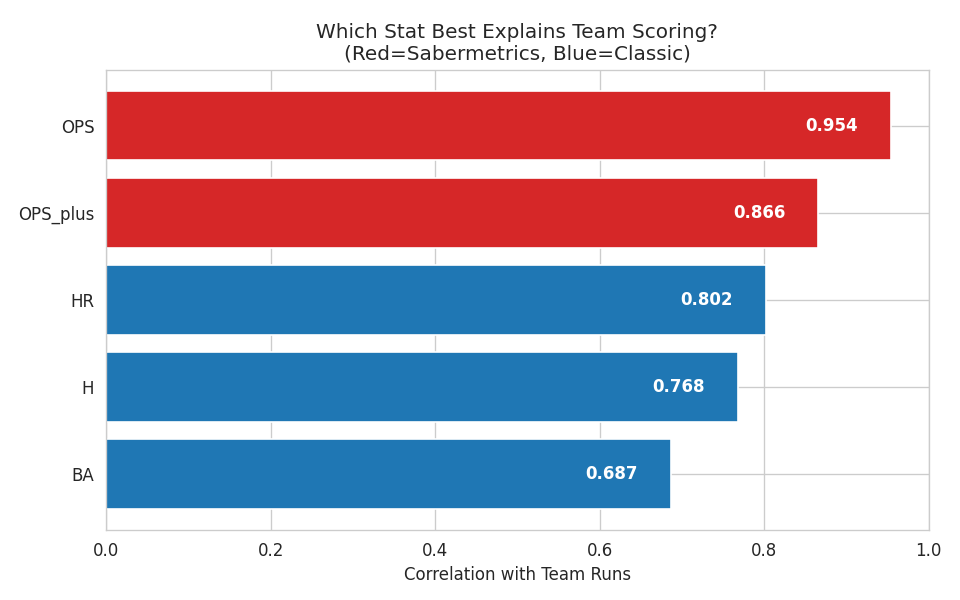

<div align="center">


# ⚾ Sabermetrics vs Classic Stats

### *무엇이 팀 성적을 더 잘 설명하는가?*

**🔗 [라이브 페이지 바로가기](https://boseongkim02.github.io/mlb-sabermetrics-analysis/)**


</div>

---

## 🎯 The Question

> 야구에서 선수와 팀을 평가할 때 오랫동안 **타율(BA)·안타(H)** 같은 전통적 '클래식 스탯'이 기준이 되어 왔다.
> 그러나 최근에는 **OPS · OPS+** 같은 세이버메트릭스 지표가 실제 기여를 더 정확히 측정한다고 평가받는다.

### **"그렇다면 실제 데이터에서도 세이버 지표가 팀 득점을 더 잘 설명할까?"**

이 질문을 직접 데이터로 검증했다.

---

## ⚙️ Analysis Design

<table>
<tr><td><b>🎯 타겟</b></td><td>팀 득점(R) — 공격 생산성의 최종 결과물</td></tr>
<tr><td><b>📊 클래식 지표</b></td><td>타율(BA) · 안타(H) · 홈런(HR)</td></tr>
<tr><td><b>🔬 세이버 지표</b></td><td>OPS · OPS+</td></tr>
<tr><td><b>📦 표본</b></td><td>MLB 2021–2024 · 30개 구단 = <b>120 팀-시즌</b></td></tr>
<tr><td><b>🧮 방법</b></td><td>각 지표와 팀 득점의 피어슨 상관계수 비교</td></tr>
</table>

> 💡 한 시즌(30팀)은 표본이 작아 4개 시즌을 결합했고, 코로나 단축시즌인 **2020년은 데이터 일관성을 위해 제외**했다.

---

## 🏆 Results

<div align="center">

| 순위 | 지표 | 분류 | 득점과의 상관 |
|:---:|:---:|:---:|:---:|
| 🥇 | **OPS** | 🔬 세이버 | **`0.954`** |
| 🥈 | **OPS+** | 🔬 세이버 | **`0.866`** |
| 🥉 | HR | 📊 클래식 | `0.802` |
| 4 | H | 📊 클래식 | `0.768` |
| 5 | BA | 📊 클래식 | `0.687` |

**🔬 세이버 평균 `0.910`  vs  📊 클래식 평균 `0.752`**



</div>

---

## 💡 Key Insights

### 1️⃣ 세이버메트릭스가 팀 득점을 더 잘 설명한다
OPS는 **0.954** 로 거의 완벽에 가까운 상관을 보였고, 세이버 그룹이 클래식을 평균 **0.16** 앞섰다.

### 2️⃣ 가장 전통적인 '타율'이 설명력은 꼴찌였다
타율(`0.687`)은 야구에서 가장 오래 떠받든 지표지만, 정작 팀 득점 설명력은 **최하위**였다.
타율은 *'안타를 쳤는가'* 만 볼 뿐 **출루와 장타라는 득점으로 이어지는 가치를 담지 못하기 때문**이다.

<div align="center">

> ### *"표면적으로 익숙한 지표가 반드시 본질을 설명하는 것은 아니다."*
> 분석의 핵심은 '눈에 익은 숫자'가 아니라 **'결과를 설명하는 숫자'** 를 찾아내는 데 있다.

</div>

---

## 🛠 Tech Stack

`Python` · `pandas` · `matplotlib` · `seaborn` · 상관분석

## 📁 Repository

```
📦 mlb-sabermetrics-analysis
 ┣ 🌐 index.html             # 라이브 포트폴리오 페이지 (GitHub Pages)
 ┣ 📊 analysis_code.py       # 분석 및 시각화 코드
 ┣ 📈 mlb_team_batting.csv   # 데이터 (120 팀-시즌)
 ┗ 📄 세이버메트릭스 vs 클래식 스텟의 생산성 차이.pdf
```

---

<div align="center">

**Made by [BoseongKim02](https://github.com/BoseongKim02)** ⚾
*데이터에서 본질을 읽다*

</div>
